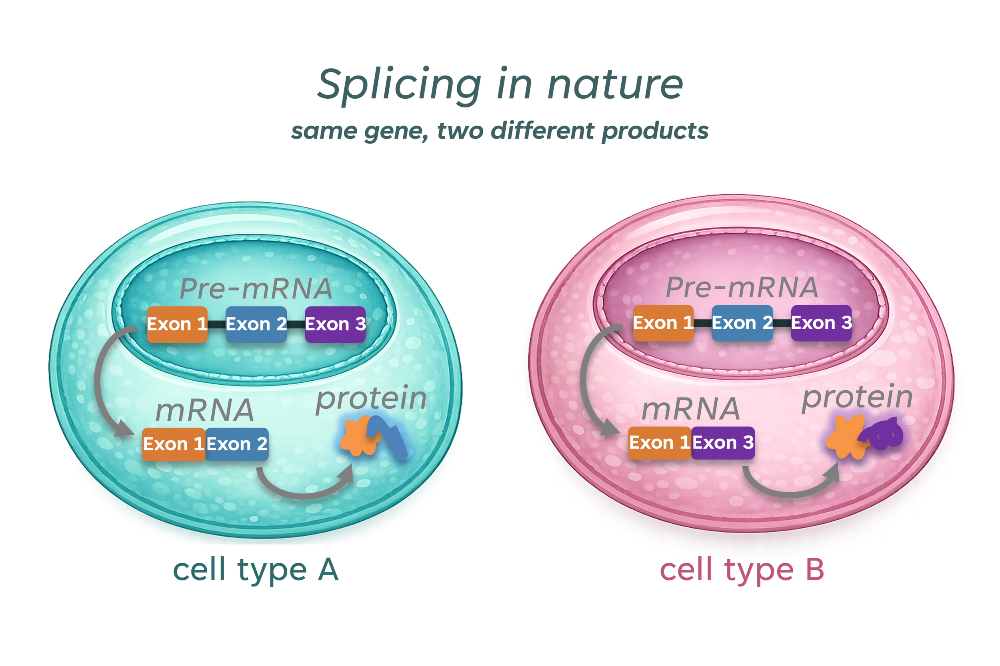
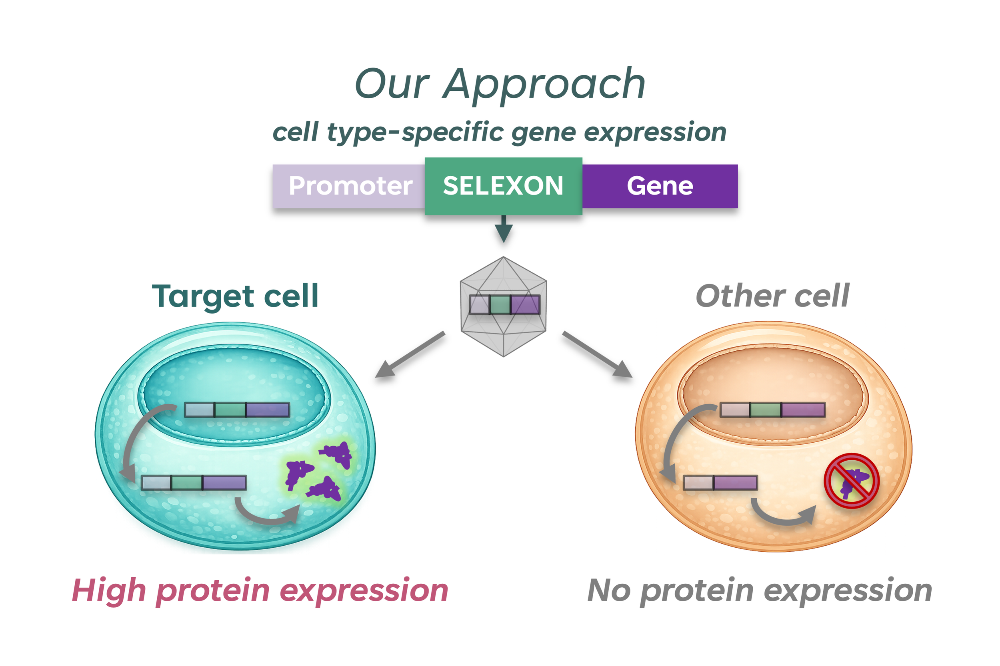

# Aletira Therapeutics

### Cell-selective gene therapies

 

*We develop gene therapies that use alternative splicing to control where gene expression occurs.*

 

[aletiratherapeutics.com](https://aletiratherapeutics.com/)

 

---

 

### The problem

Gene therapies deliver therapeutic genes to patients, but current approaches lack precise control over *which cells* express the gene product. Off-target expression limits safety, restricts promoter choice, and complicates translation from animal models to humans.

### Inspired by nature

Nature uses alternative splicing to generate distinct proteins from a single gene. This fundamental biological principle underlies cellular diversity across tissues — and is the basis for Aletira's technology.

 

### Our approach

**SELEXON™** (selective exon) technology harnesses naturally occurring alternative splicing events to enable cell-type selective gene expression in therapeutic constructs. SELEXONs can be incorporated into any gene therapy platform (e.g., AAV) to ensure gene products are expressed only in the intended target cells.

 

<table>
<tr>
<td width="33%" align="center"><b>Improving safety</b>  Gene expression excluded from off-target cells</td>
<td width="33%" align="center"><b>Increasing potency</b>  Combination with strong promoters without off-target risk</td>
<td width="33%" align="center"><b>Accelerating development</b>  Splicing is conserved — translatable across species</td>
</tr>
</table>

 

### Our team

Aletira brings together drug development, computational biology, AI, and RNA regulation expertise from Johns Hopkins, Scripps Research, UT Southwestern, Indiana University, and multiple venture-backed biotechs.

 

---

📍 Baltimore, MD&ensp;·&ensp;[Contact us](https://aletiratherapeutics.com/contact)

